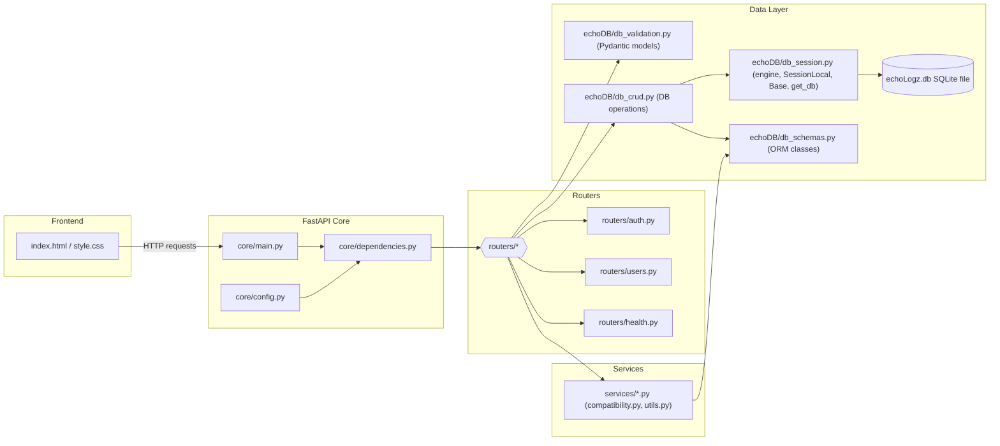
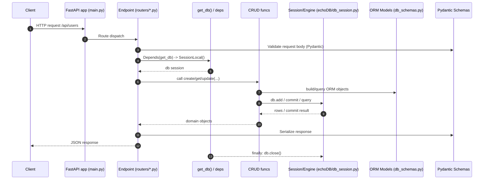

```mermaid
flowchart LR
  subgraph Frontend
    FE[index.html / style.css]
  end

  subgraph FastAPI Core
    MAIN[core/main.py]
    CFG[core/config.py]
    DEPS[core/dependencies.py]
  end

  subgraph Routers
    ROUTERS{{routers/*}}
    AUTH[routers/auth.py]
    USERS[routers/users.py]
    HEALTH[routers/health.py]
  end

  subgraph Data Layer
    DBMOD["echoDB/db_session.py (engine, SessionLocal, Base, get_db)"]
    MODELS["echoDB/db_schemas.py (ORM classes)"]
    SCHEMAS["echoDB/db_validation.py (Pydantic models)"]
    CRUD["echoDB/db_crud.py (DB operations)"]
    FILEDB[(echoLogz.db SQLite file)]
  end

  subgraph Services
    SRV["services/*.py (compatibility.py, utils.py)"]
  end

  %% Frontend -> app
  FE -->|HTTP requests| MAIN

  %% Core flow you wanted
  MAIN --> DEPS
  CFG --> DEPS
  DEPS --> ROUTERS

  %% Routers fan-out
  ROUTERS --> AUTH
  ROUTERS --> USERS
  ROUTERS --> HEALTH

  %% Routers use services, schemas, and CRUD
  ROUTERS --> SRV
  ROUTERS --> SCHEMAS
  ROUTERS --> CRUD

  %% CRUD & models & DB
  CRUD --> MODELS
  CRUD --> DBMOD
  DBMOD --> FILEDB

  %% Services may also use models (optional)
  SRV --> MODELS
```

```mermaid
sequenceDiagram
  autonumber
  participant Client
  participant App as FastAPI app (main.py)
  participant Router as Endpoint (routers/*.py)
  participant Deps as get_db() / deps
  participant CRUD as CRUD funcs
  participant DB as Session/Engine (echoDB/db_session.py)
  participant Models as ORM Models (db_schemas.py)
  participant Schemas as Pydantic Schemas

  Client->>App: HTTP request /api/users
  App->>Router: Route dispatch
  Router->>Schemas: Validate request body (Pydantic)
  Router->>Deps: Depends(get_db) -> SessionLocal()
  Deps-->>Router: db session
  Router->>CRUD: call create/get/update(...)
  CRUD->>Models: build/query ORM objects
  CRUD->>DB: db.add / commit / query
  DB-->>CRUD: rows / commit result
  CRUD-->>Router: domain objects
  Router->>Schemas: Serialize response
  Router-->>Client: JSON response
  Deps-->>DB: finally: db.close()
```