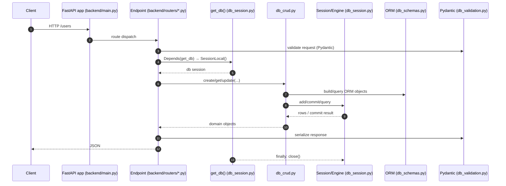

```mermaid
sequenceDiagram
  autonumber
  participant FE as Frontend
  participant SPOTR as routers/spotify_auth.py
  participant CALLS as services/spotify_calls.py
  participant DB as echoDB (tokens table via db_crud)

  FE->>SPOTR: GET /auth/spotify/login
  SPOTR-->>FE: 302 → Spotify authorize URL

  FE->>SPOTIFY: user consents
  SPOTIFY-->>SPOTR: redirect /auth/spotify/callback?code=...

  SPOTR->>CALLS: exchange_code_for_tokens(code)
  CALLS-->>SPOTR: access_token, refresh_token, expires_at
  SPOTR->>DB: persist tokens (via db_crud)
  SPOTR-->>FE: 200/login OK

  FE->>SPOTR: GET /auth/me (optional)
  SPOTR->>CALLS: get_user_profile(access_token)
  CALLS-->>SPOTR: profile JSON
  SPOTR-->>FE: profile JSON
  ```
